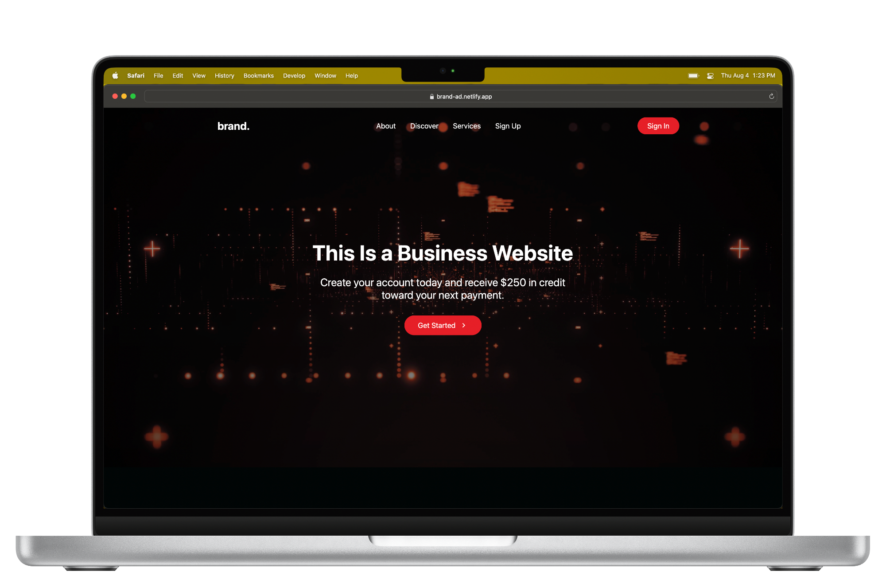

# brand. 📁

This modern website wasn't my first business-focused project, nor was it my first time starting from a fresh create-react-app setup, but "brand." did mark my first website designed using styled-components.

I welcomed an opportunity to strengthen my ability to work with React, and learning about styled-components was a significant bonus! As a result of creating this website, I have more confidence that I'll be able to make similar sites for actual production moving forward.

## To Do ✅

- Fix a weird issue with the sidebar on mobile

## Author 👨🏻‍💻

- Aaron Durant // [aarondurant.com](https://aarondurant.com) // [@AaronRDurant](https://twitter.com/AaronRDurant)
